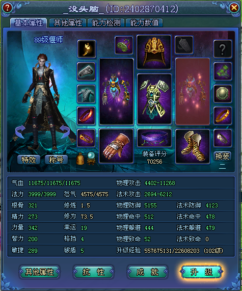

@@ -1,37 +0,0 @@
## Hello Wooooorld！！！
### 写在前面
简陋的页面，拙劣的文字，渣渣的技术，也许是我人生中最郁闷的时刻，希望这个没啥人会看的博客能成为我的寄托。不知道怎样购买域名，不知道怎样配置网址，就连markdown的语法也是不怎么知道，有时候真是感慨，为啥自己就这么渣渣呢。。。
转眼间啊，我已经当了快二十年的学生了，但是仔细想来，却始终不知道自己究竟会啥，可悲。。。可悲。。。
自从被带入某坑之后，觉得自己整个人都变了，没有什么斗志，拖延自己的工作，甚至连对女票好像都不如以前上心了，自己却浑然不知，乐此不疲。
牢骚总是要发的，但是终归要有个头，既然已经这么差劲了，那还不好好工作，准备以后摆地摊吗。。。说不定还会上报纸，985硕士街头摆地摊，一定也会成为某些人读书无用论的强力论据orz。
于是，坑爹的我，决定逆袭啦！！！！！！！！！！！！！！！！！！！！
### 2017年3月11日
先来说说某坑是什么吧，自从人生中第一次面试失败了之后，从来没有碰过mmorpg网游的我居然也开始玩上了网游。多亏了我的芮芮，这个坑也是越陷越深。更令人糟心的是啊，我居然爱上了这个世界。从炉石传说到守望先锋，一直以暴雪玩家的高端姿态居高临下俯视众生的我，居然也玩起了娘炮国产辣鸡网游？？？还开心的给人家送钱？？？这到底都是些什么东西。最后还是没玩好吧，也就这样了，投入了那么多时间终究还是个菜鸡，发图留念，走好不送。
```html

```

```算法篇
Syntax highlighted code block

# Header 1
## Header 2
### Header 3

- Bulleted
- List

1. Numbered
2. List

**Bold** and _Italic_ and `Code` text

[Link](url) and 
```
么
For more details see [GitHub Flavored Markdown](https://guides.github.com/features/mastering-markdown/).

### Jekyll Themes

Your Pages site will use the layout and styles from the Jekyll theme you have selected in your [repository settings](https://github.com/Nathan0Gnome/nathan0gnome.github.com/settings). The name of this theme is saved in the Jekyll `_config.yml` configuration file.

### Support or Contact

Having trouble with Pages? Check out our [documentation](https://help.github.com/categories/github-pages-basics/) or [contact support](https://github.com/contact) and we’ll help you sort it out.
